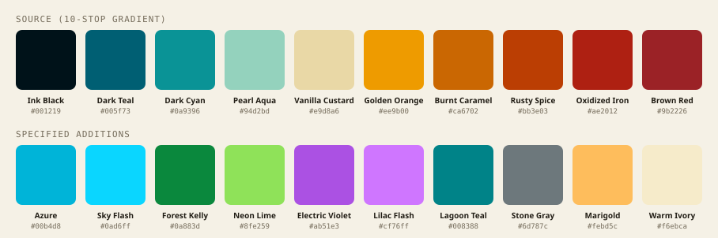
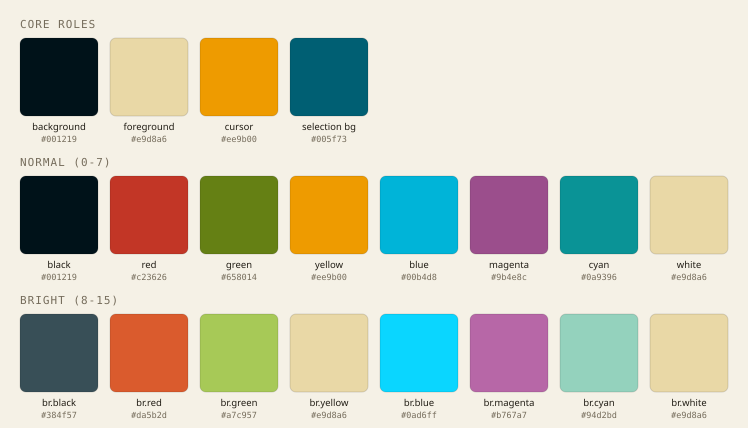

# EmberTide

A dark terminal theme built from a 10-stop teal→ember gradient, with a synthesized
green/blue/magenta so every ANSI slot actually looks different from the others.



## Preview



## Why this exists

The source is a 10-color data-viz gradient (teal → cyan → aqua → gold → caramel → red) with
no true green, blue, or magenta stop. A naive first pass reused the same dark teal for
green, blue, *and* bright-black — which breaks things like `ls` (directories vs.
executables), git prompts, and diff highlighting, all of which depend on those colors
actually being distinguishable.

This version (the **Reef** variant) fixes that instead of hiding it:

- **Green, blue, and magenta are synthesized** — nearest source hue rotated in OKLCH to a
  correct ANSI hue band (green ≈132°, blue ≈240°, magenta ≈335°), at moderate chroma so
  they stay in the same tonal family as the rest of the palette.
- **Red and bright-black are lifted** just enough to clear text-contrast floors against
  the `#001219` background — the original `#ae2012` red and `#9b2226` magenta sat at
  ~2.7:1 and ~2.4:1 contrast, both unreadable as body text.
- **Background, foreground, yellow, cyan, white, cursor, and selection are untouched** —
  they were already hue-accurate and high-contrast in the source palette.
- **Contrast floors:** ≥3.5:1 for the normal row, ≥5:1 for the bright row, ≥2:1 for
  bright-black (which is meant to be dim, not readable body text).

Every claim above is asserted by [`scripts/build.py`](scripts/build.py) — see
[Regenerating](#regenerating) — so it can't silently drift from what's documented here.

## Supported terminals

| Terminal | File | Install |
|---|---|---|
| [iTerm2](#iterm2) | `iterm2/EmberTide.itermcolors` | Import via Preferences |
| [Alacritty](#alacritty) | `alacritty/embertide.toml` | `import` in `alacritty.toml` |
| [Ghostty](#ghostty) | `ghostty/EmberTide` | `theme = EmberTide` |
| [kitty](#kitty) | `kitty/embertide.conf` | `include` in `kitty.conf` |
| [WezTerm](#wezterm) | `wezterm/EmberTide.toml` | `color_scheme` in `wezterm.lua` |
| [Windows Terminal](#windows-terminal) | `windows-terminal/embertide.json` | paste into `settings.json` |
| [Warp](#warp) | `warp/embertide.yaml` | drop into `~/.warp/themes` |
| [tmux](#tmux) | `tmux/embertide.tmux` | `source-file` in `.tmux.conf` |
| [VS Code](#vs-code-integrated-terminal) | `vscode/embertide.settings.json` | merge into `settings.json` |

### iTerm2

1. Preferences → Profiles → Colors → Color Presets… → Import…
2. Select `iterm2/EmberTide.itermcolors`.
3. Choose **EmberTide** from the Color Presets dropdown.

### Alacritty

```sh
mkdir -p ~/.config/alacritty/themes
cp alacritty/embertide.toml ~/.config/alacritty/themes/
```

In `~/.config/alacritty/alacritty.toml`:

```toml
[general]
import = ["~/.config/alacritty/themes/embertide.toml"]
```

### Ghostty

```sh
mkdir -p ~/.config/ghostty/themes
cp ghostty/EmberTide ~/.config/ghostty/themes/EmberTide
```

In `~/.config/ghostty/config`:

```
theme = EmberTide
```

### kitty

```sh
mkdir -p ~/.config/kitty/themes
cp kitty/embertide.conf ~/.config/kitty/themes/
```

In `~/.config/kitty/kitty.conf`:

```
include themes/embertide.conf
```

### WezTerm

```sh
mkdir -p ~/.config/wezterm/colors
cp wezterm/EmberTide.toml ~/.config/wezterm/colors/
```

In `~/.config/wezterm/wezterm.lua`:

```lua
config.color_scheme = 'EmberTide'
```

### Windows Terminal

Open `settings.json` (Settings → Open JSON file), paste the contents of
`windows-terminal/embertide.json` into the `"schemes"` array, then set
`"colorScheme": "EmberTide"` on the profile(s) you want themed.

### Warp

```sh
mkdir -p ~/.warp/themes
cp warp/embertide.yaml ~/.warp/themes/
```

Settings → Appearance → Themes → **EmberTide**.

### tmux

```sh
mkdir -p ~/.config/tmux
cp tmux/embertide.tmux ~/.config/tmux/
```

In `~/.tmux.conf`:

```
source-file ~/.config/tmux/embertide.tmux
```

tmux inherits its 16 ANSI colors from the terminal emulator underneath it — pair this
with one of the terminal themes above for the pane content, not just the status bar.

### VS Code integrated terminal

Merge the `workbench.colorCustomizations` block from `vscode/embertide.settings.json`
into your user or workspace `settings.json`.

## Color reference

### Core roles

| Role | Hex |
|---|---|
| Background | `#001219` |
| Foreground | `#e9d8a6` |
| Cursor | `#ee9b00` |
| Selection background | `#005f73` |

### ANSI — normal

| # | Role | Hex | Contrast vs. bg |
|---|---|---|---|
| 0 | Black | `#001219` | — |
| 1 | Red | `#c23626` | 3.5:1 |
| 2 | Green | `#558227` | 4.2:1 |
| 3 | Yellow | `#ee9b00` | 8.5:1 |
| 4 | Blue | `#006faa` | 3.5:1 |
| 5 | Magenta | `#9b4e8c` | 3.5:1 |
| 6 | Cyan | `#0a9396` | 5.1:1 |
| 7 | White | `#e9d8a6` | 13.5:1 |

### ANSI — bright

| # | Role | Hex | Contrast vs. bg |
|---|---|---|---|
| 8 | Bright black | `#384f57` | 2.2:1 |
| 9 | Bright red | `#da5b2d` | 5.0:1 |
| 10 | Bright green | `#6f9d44` | 6.0:1 |
| 11 | Bright yellow | `#e9d8a6` | 13.5:1 |
| 12 | Bright blue | `#1c8ac7` | 5.0:1 |
| 13 | Bright magenta | `#b767a7` | 5.0:1 |
| 14 | Bright cyan | `#94d2bd` | 11.1:1 |
| 15 | Bright white | `#e9d8a6` | 13.5:1 |

White, bright yellow, and bright white are intentionally the same hex (`#e9d8a6`) — the
source palette's lightest stop, reused as the theme's neutral light color. Every other
slot is unique.

### Source palette

| Name | Hex |
|---|---|
| Ink Black | `#001219` |
| Dark Teal | `#005f73` |
| Dark Cyan | `#0a9396` |
| Pearl Aqua | `#94d2bd` |
| Vanilla Custard | `#e9d8a6` |
| Golden Orange | `#ee9b00` |
| Burnt Caramel | `#ca6702` |
| Rusty Spice | `#bb3e03` |
| Oxidized Iron | `#ae2012` |
| Brown Red | `#9b2226` |

## Regenerating

Every file in this repo (all nine terminal configs plus the two reference SVGs) is
generated from a single palette dict in [`scripts/build.py`](scripts/build.py). To
change a color, edit `FINAL` in that file and re-run:

```sh
python3 scripts/build.py
```

The script asserts, before writing anything:

- no unexpected ANSI slot collisions (the white/bright-yellow/bright-white group is the
  one intentional exception),
- every bright color is lighter (higher OKLab L) than its normal counterpart,
- every normal-row color clears 3.5:1 contrast against the background, every bright-row
  color clears 5:1, and bright-black clears 2:1.

If an edit fails one of those, the script exits with an assertion error instead of
writing a file that quietly breaks the guarantees above.

## License

MIT — see [LICENSE](LICENSE).
